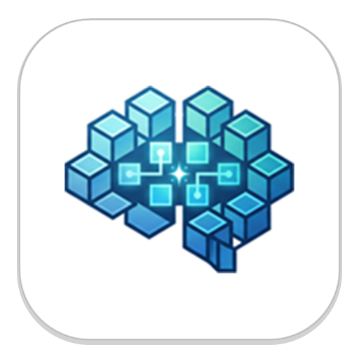
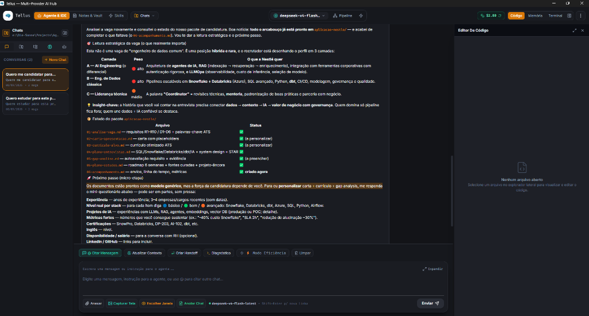
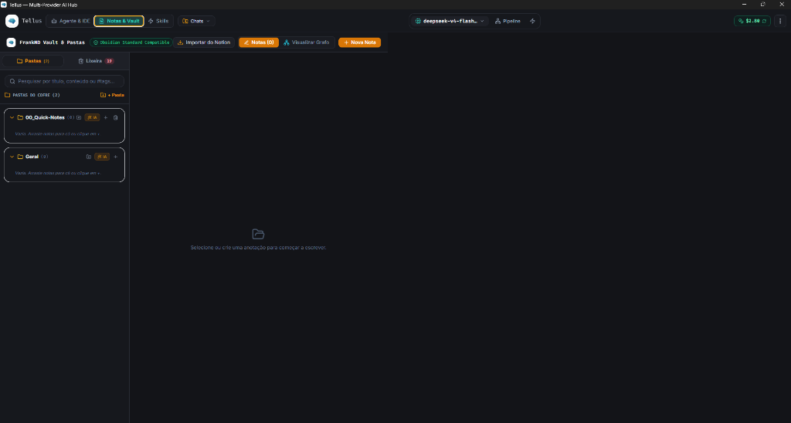
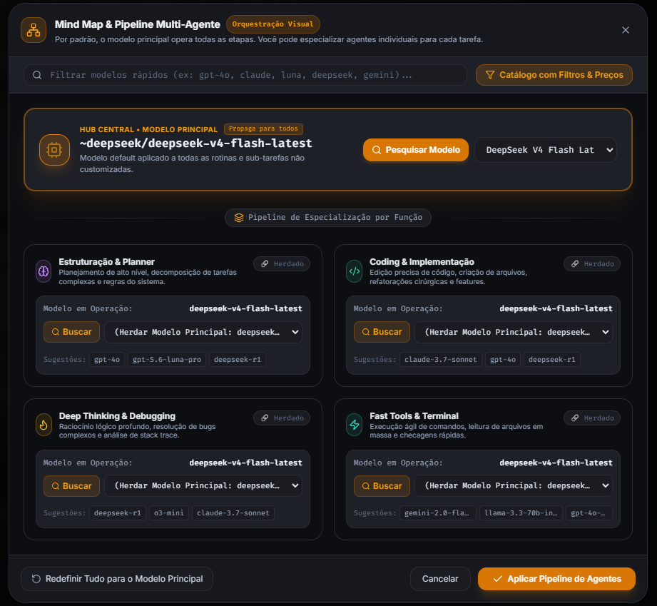
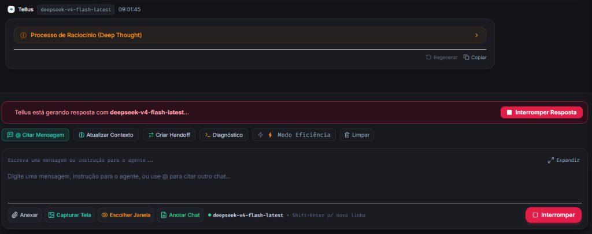

<div align="center">



# 🌐 Tellus (Agentic IDE)
### *Ambiente Integrado de Desenvolvimento Agêntico, Gestão de Conhecimento Obsidian/FrankMD e Engenharia de Carreira*

[](https://react.dev/)
[](https://www.typescriptlang.org/)
[](https://nodejs.org/)
[](https://tailwindcss.com/)
[](https://obsidian.md/)
[](LICENSE)

</div>

---

## 📌 Visão Geral

**Tellus** é uma IDE agêntica de nova geração que combina orquestração multi-modelo de inteligência artificial, execução local segura de ferramentas de código e terminal, curadoria de memória de longo prazo e um ecossistema completo de gestão de conhecimento compatível com **Obsidian Markdown (`FrankMD Vault`)**.

Projetado para engenheiros de dados, desenvolvedores e pesquisadores, o Tellus transforma requisitos complexos de vagas e editais em planos de estudo e projetos práticos, mantendo um cofre de conhecimento interconectado por grafos.

---

## 🖼️ Capturas de Tela do Sistema

<div align="center">

### 💻 1. Workspace Agêntico, Engenharia de Carreira & Links Clicáveis
*Interface moderna de chat com renderização rica de estratégias de vagas, links interativos para notas no Vault e painel lateral.*


---

### 📚 2. FrankMD Vault, Pastas Obsidian & Lixeira com Retenção
*Cofre compatível com Obsidian, árvore de pastas hierárquica e controle completo de retenção da lixeira.*


---

### 🧭 3. Orquestração Multi-Agente Visual (Pipeline Mind Map)
*Mapeamento visual e especialização de papéis entre modelos (Hub Central, Planner, Coding, Deep Thinking, Fast Tools).*


---

### ⚡ 4. Raciocínio Profundo (Deep Thought) & Barra de Ações Rápidas
*Streaming em tempo real com processo analítico de raciocínio, citação de mensagens, atualização de contexto e modo eficiência.*


</div>

---

## ✨ Principais Funcionalidades

### 🧠 1. Orquestração Multi-Modelo e Agentes Especializados
- **Suporte a Provedores Líderes:** Integração nativa com OpenRouter, Google Gemini, Anthropic Claude, OpenAI e DeepSeek.
- **Divisão de Papéis em Pipeline:**
  - `Planner / Architect:` Decomposição de tarefas de alto nível.
  - `Deep Reasoning:` Rastreamento profundo de erros com modelos como *DeepSeek R1*.
  - `Fast Tools & Coder:` Execução ágil de ferramentas e geração de código com *Gemini 2.0 Flash / DeepSeek V4 Flash*.
  - `Memory Curator:` Gestão da memória ativa e persistência de decisões do projeto.

### 🗂️ 2. FrankMD Vault (Cofre de Notas Obsidian)
- **Visualização Formatada e Split Editor:** Renderização rica de Markdown, tabelas, blocos de código com destaque de sintaxe e modo de edição rápida.
- **Hierarquia de Pastas e Subpastas:** Crie, renomeie, arraste pastas para dentro de outras pastas ou mova notas com suporte a drag-and-drop.
- **Visualização em Grafo Interativo (Tela Cheia):** Grafo Obsidian com física em tempo real para explorar conexões entre notas `[[Wikilinks]]`, `#tags` e pastas.
- **Links Clicáveis no Chat:** Qualquer nota ou arquivo gerado pelo agente (ex: `` `01-analise-vaga.md` ``) vira um chip interativo que abre diretamente o documento no cofre.

### 🗑️ 3. Lixeira Inteligente & Políticas de Retenção
- **Proteção contra Exclusão Acidental:** Pastas e notas deletadas são movidas para o diretório de segurança `.backups`.
- **Períodos de Retenção Configuráveis:**
  - `30 dias`
  - `90 dias (Padrão)`
  - `120 dias`
  - `1 ano`
  - `Sempre (Nunca excluir definitivamente)`
- **Restauração Rápida:** Recupere notas para sua pasta de origem com um clique.
- **Agente com Consciência de Disco:** O agente valida se as notas existem fisicamente no cofre e recria planos atualizados caso tenham sido excluídas.

### ⚡ 4. Processamento Otimizado de Arquivos & PDFs
- **Extração Sem Erros de Buffer:** Tratamento seguro de PDFs volumosos (como provas de concursos e editais) com persistência em `.agentic/attachments/` e controle de tamanho para evitar interrupções de stream.

---

## 🧪 Exemplos de Uso e Testes de Prompts

### 🎯 Exemplo 1: Preparação Completa para Vaga de Emprego
**Prompt de entrada:**
```text
quero me candidatar a essa vaga:
Experiência sólida em Engenharia de Dados e soluções analíticas em escala.
Conhecimento avançado em Snowflake, modelagem de dados, otimização de queries e governança.
Experiência com Databricks, PySpark e arquiteturas modernas de Lakehouse.
Proficiência em SQL avançado, Python e desenvolvimento de pipelines com dbt.
```

**Resultado gerado no Vault:**
1. Criação automática da pasta `carreira/vaga-engenheiro-dados-senior/`.
2. `01-analise-vaga.md`: Mapeamento de gaps e requisitos prioritários.
3. `02-roteiro-estudo.md`: Cronograma por semanas e módulos de nivelamento.
4. `03-projetos-praticos.md`: Especificações de 2 projetos de portfólio (ex: Pipeline dbt + Snowflake).
5. `04-perguntas-tecnicas-entrevista.md`: Simulação de sabatina técnica com respostas ideais.
6. `05-acompanhamento-candidatura.md`: Checklist de aplicação e networking.

---

### 📖 Exemplo 2: Plano de Estudos a partir de PDFs de Prova e Gabarito
**Prompt de entrada:**
```text
Analisar os 2 PDFs em anexo (Caderno de Provas SPREGULA e Gabarito Oficial).
Crie um plano de estudos com cronograma, análise das questões com maior peso,
conceitos teóricos exigidos e exercícios práticos para cada matéria.
```

**Resultado gerado no Vault:**
- Criação da pasta `estudos/concurso-spregula/` contendo notas temáticas para Regulação, Direito Administrativo e Legislação Específica, com links cruzados e bibliografia recomendada.

---

## 🏗️ Arquitetura do Projeto

```text
Tellus/
├── client/                     # Frontend React 19 + TypeScript + Vite + TailwindCSS
│   ├── src/
│   │   ├── components/
│   │   │   ├── ChatArea.tsx           # Área de chat com renderizador de Markdown & Chips clicáveis
│   │   │   ├── FrankNoteView.tsx      # Cofre Obsidian, Árvore de Pastas, Grafo & Lixeira
│   │   │   ├── SettingsModal.tsx      # Configurações de API Keys, Tema e Retenção
│   │   │   ├── PipelineMindMapModal.tsx # Mindmap de orquestração multi-agente
│   │   │   └── Sidebar.tsx            # Navegação de projetos, histórico e rotinas
│   │   ├── api.ts                     # Cliente REST & WebSocket para comunicação com o backend
│   │   └── types.ts                   # Definições de tipos TypeScript
│   └── vite.config.ts
│
├── server/                     # Backend Node.js + Express + TypeScript
│   ├── src/
│   │   ├── services/
│   │   │   ├── agentLoop.ts           # Loop autônomo do agente, invocação de tools e streaming
│   │   │   ├── configManager.ts       # Gestão persistente de configurações locais
│   │   │   ├── notes/
│   │   │   │   └── frankNoteEngine.ts # Motor do Vault (CRUD, Grafo, Pastas, Backups & Lixeira)
│   │   │   ├── providers/
│   │   │   │   └── openrouter.ts      # Streaming SSE resiliente para OpenRouter e LLMs
│   │   │   └── tools/
│   │   │       ├── fileParser.ts      # Extração de PDF, CSV e arquivos com buffer safe
│   │   │       ├── fileManager.ts     # Manipulação de arquivos do projeto
│   │   │       └── terminalRunner.ts  # Execução local segura de comandos e scripts
│   │   └── index.ts                   # Rotas da API REST e inicialização do servidor
│   └── tsconfig.json
│
└── docs/                       # Recursos visuais e documentação
    └── assets/                 # Imagens e capturas do sistema
```

---

## 🚀 Como Executar Localmente

### Pré-requisitos
- [Node.js](https://nodejs.org/) (versão 18 ou superior)
- [npm](https://www.npmjs.com/) ou [pnpm](https://pnpm.io/)

### 1. Clonar o Repositório
```bash
git clone https://github.com/lucasyamaguchi/Tellus.git
cd Tellus
```

### 2. Instalar Dependências
```bash
# Instalar dependências do backend
cd server
npm install

# Instalar dependências do frontend
cd ../client
npm install
```

### 3. Iniciar o Ambiente de Desenvolvimento
```bash
# Terminal 1 - Backend (Porta 3001)
cd server
npm run dev

# Terminal 2 - Frontend (Porta 5173)
cd client
npm run dev
```

Abra seu navegador em `http://localhost:5173` para acessar o Tellus.

---

## 🔒 Segurança e Privacidade

- **Armazenamento 100% Local:** Suas anotações, arquivos do cofre, histórico de conversas e chaves de API permanecem na sua máquina.
- **Comunicação Direta:** As requisições para os provedores de inteligência artificial trafegam diretamente do seu cliente para as APIs oficiais via HTTPS criptografado.

---

## 📄 Licença

Este projeto é distribuído sob a licença **MIT**. Consulte o arquivo [LICENSE](LICENSE) para obter mais informações.

<div align="center">
  <sub>Desenvolvido com foco em autonomia, clareza e alto desempenho agêntico.</sub>
</div>