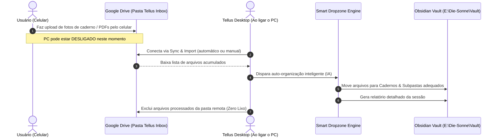

# 📥 Issue #03: Ingestão Remota Assíncrona via Google Drive ➔ Smart Dropzone

## 📌 Contexto & Objetivo
Permitir que o usuário envie fotos de páginas de caderno, PDFs de apostilas, capturas de tela ou gravações a partir do celular para o Google Drive a qualquer momento do dia (mesmo com o computador de casa completamente desligado). Quando o Tellus for aberto e acionado o comando **"Sync & Import"**, todos os arquivos pendentes são puxados para a pipeline da Smart Dropzone, organizados nos cadernos do cofre e excluídos da pasta do Drive para mantê-la limpa.

---

## 🔄 Fluxo de Funcionamento

---

## 🛠️ Arquitetura de Conexão

### Modo 1: Google Drive Desktop (Mais Simples & Zero Chaves de API)
* O aplicativo oficial do Google Drive no Windows mapeia uma unidade (ex: `G:\Meu Drive\Tellus Inbox` ou `C:\Users\...\Google Drive\Tellus Inbox`).
* O Tellus monitora esse caminho de pasta local.
* Quando o Windows inicia, o Google Drive já sincronizou tudo em segundo plano.
* O Tellus lê os arquivos diretamente do disco, processa com a Smart Dropzone e faz o `fs.unlink()` no drive local (o que sincroniza a exclusão com a nuvem automaticamente).

### Modo 2: Google Drive API (OAuth 2.0 / Service Account)
* Conexão via API REST oficial do Google Drive (`googleapis`).
* Não depende do Google Drive Desktop instalado.
* O Tellus consulta a pasta `Tellus Inbox` via token OAuth seguro, faz o download dos arquivos em buffer, dispara a organização e chama `drive.files.delete({ fileId })`.

---

## 📋 Tarefas de Implementação
- [ ] Configuração do caminho da pasta ou autenticação do Google Drive nas configurações do Tellus (`config.json`).
- [ ] Criação do botão **"🔄 Puxar do Google Drive"** dentro da modal da `Smart Dropzone` e na barra de ferramentas da Home.
- [ ] Opção de auto-sincronização na inicialização do Tellus.
- [ ] Flag configurável: `Excluir permanentemente do Drive após organizar` vs `Mover para subpasta 'Processados'`.
- [ ] Higienização com o `PrivacySanitizer` antes da escrita no cofre local.
